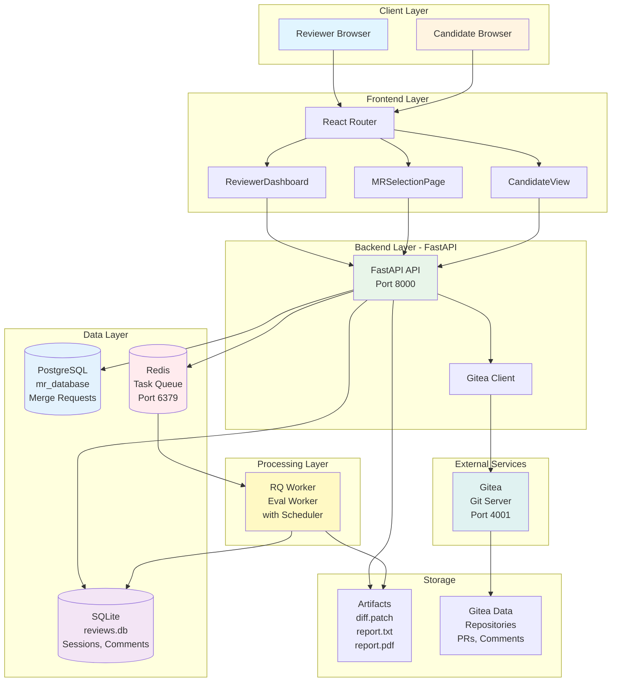
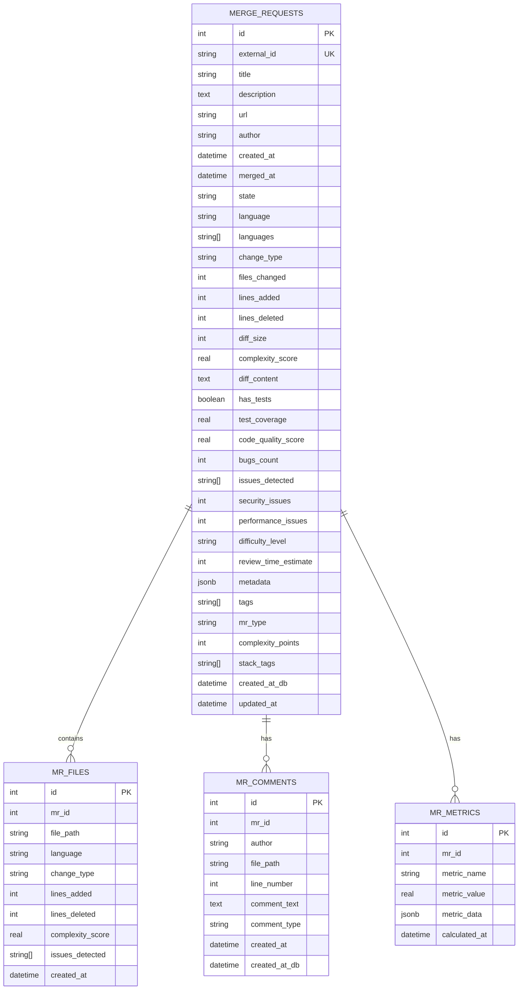
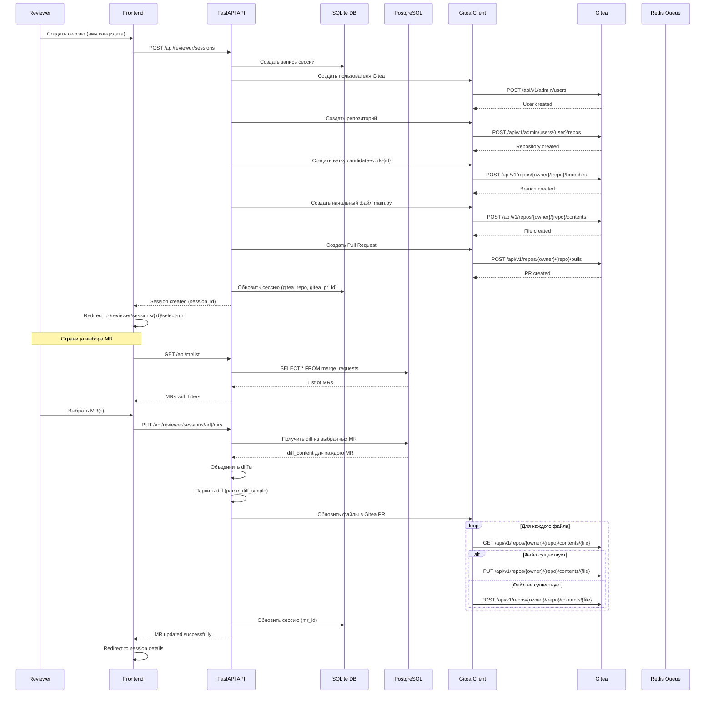
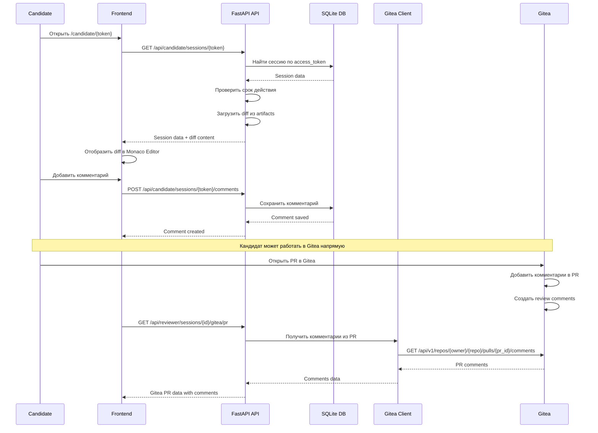
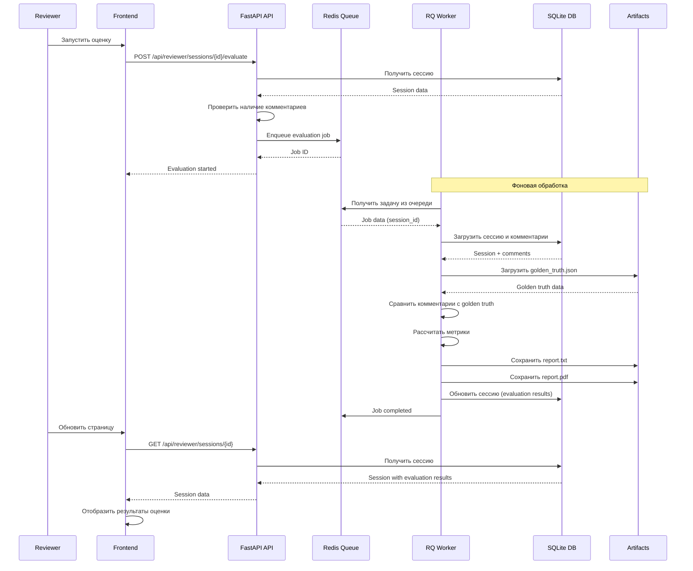
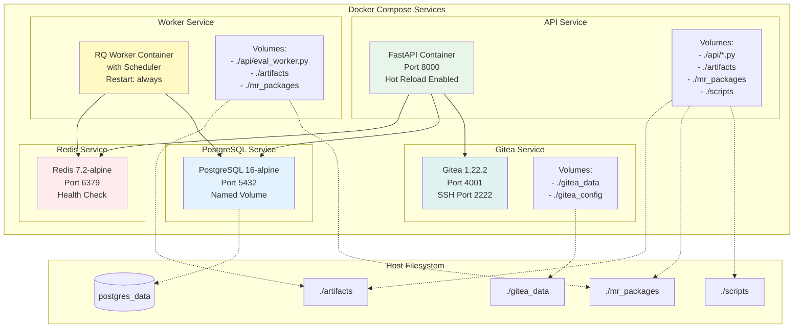
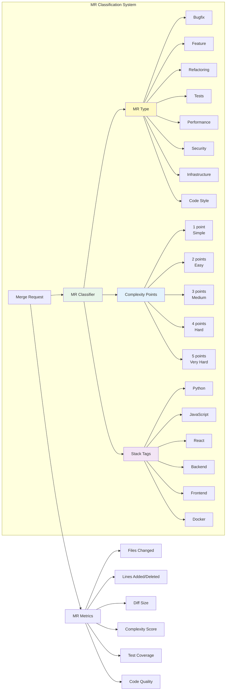

# Code Review Platform - Архитектурные диаграммы

Этот документ содержит визуальные диаграммы архитектуры и логики работы приложения Code Review Platform.

## 1. Общая архитектура системы



## 2. Архитектура базы данных

### 2.1 SQLite (Sessions & Comments)

```mermaid
erDiagram
    SESSIONS ||--o{ COMMENTS : has
    SESSIONS {
        int id PK
        string candidate_id
        string candidate_name
        string reviewer_name
        string mr_package
        text comments JSON
        datetime created_at
        datetime expires_at
        string access_token
        string reviewer_token
        int mr_id
        string gitea_user
        string gitea_repo
        int gitea_pr_id
        boolean gitea_enabled
        datetime candidate_ready_at
        datetime deleted_at
    }
    
    COMMENTS {
        int id PK
        int session_id
        string file_path
        int line_number
        string comment_text
        datetime created_at
    }
```

### 2.2 PostgreSQL (Merge Requests)



## 3. Поток создания сессии с выбором MR



## 4. Поток работы кандидата



## 5. Поток оценки сессии (Evaluation)



## 6. Архитектура компонентов Docker



## 7. Классификация Merge Requests



## 8. Поток выбора и применения MR

```mermaid
flowchart TD
    Start([Reviewer создает сессию]) --> CreateSession[Создать сессию в SQLite]
    CreateSession --> CreateGitea[Создать Gitea репозиторий и PR]
    CreateGitea --> Redirect[Redirect to MR Selection Page]
    
    Redirect --> LoadMRs[Загрузить список MR из PostgreSQL]
    LoadMRs --> FilterMRs[Применить фильтры:<br/>- Type<br/>- Complexity<br/>- Stack Tags]
    
    FilterMRs --> DisplayMRs[Отобразить MR с тегами и баллами]
    DisplayMRs --> SelectMRs{Reviewer выбирает MR}
    
    SelectMRs -->|Выбрано| UpdateSession[PUT /api/reviewer/sessions/{id}/mrs]
    SelectMRs -->|Пропустить| Skip[Пропустить выбор MR]
    
    UpdateSession --> FetchDiffs[Получить diff_content из PostgreSQL]
    FetchDiffs --> ParseDiffs[Парсить diff для каждого MR]
    ParseDiffs --> CombineDiffs[Объединить diff'ы]
    CombineDiffs --> SaveArtifact[Сохранить в artifacts/{id}_diff.patch]
    
    SaveArtifact --> UpdateGitea[Обновить файлы в Gitea PR]
    UpdateGitea --> CheckFile{Файл существует?}
    
    CheckFile -->|Да| UpdateFile[PUT /api/v1/repos/.../contents/{file}]
    CheckFile -->|Нет| CreateFile[POST /api/v1/repos/.../contents/{file}]
    
    UpdateFile --> UpdateSQLite[Обновить session.mr_id в SQLite]
    CreateFile --> UpdateSQLite
    
    UpdateSQLite --> Success[MR успешно применены]
    Skip --> Success
    Success --> SessionReady[Сессия готова для кандидата]
    
    style Start fill:#e1f5ff
    style SelectMRs fill:#fff9c4
    style UpdateSession fill:#e8f5e9
    style Success fill:#c8e6c9
```

## 9. Интеграция с Gitea

```mermaid
graph TB
    subgraph "Code Review Platform"
        API[FastAPI API]
        GC[Gitea Client]
    end
    
    subgraph "Gitea API Endpoints"
        Users[User Management<br/>POST /api/v1/admin/users]
        Repos[Repository Management<br/>POST /api/v1/admin/users/{user}/repos]
        Branches[Branch Management<br/>POST /api/v1/repos/{owner}/{repo}/branches]
        Files[File Operations<br/>GET/POST/PUT /api/v1/repos/{owner}/{repo}/contents]
        PRs[Pull Requests<br/>POST /api/v1/repos/{owner}/{repo}/pulls]
        Comments[PR Comments<br/>GET /api/v1/repos/{owner}/{repo}/pulls/{id}/comments]
    end
    
    subgraph "Gitea Server"
        Gitea[Gitea Instance<br/>Port 4001]
        RepoData[(Repository Data)]
        UserData[(User Data)]
    end
    
    API --> GC
    GC --> Users
    GC --> Repos
    GC --> Branches
    GC --> Files
    GC --> PRs
    GC --> Comments
    
    Users --> Gitea
    Repos --> Gitea
    Branches --> Gitea
    Files --> Gitea
    PRs --> Gitea
    Comments --> Gitea
    
    Gitea --> RepoData
    Gitea --> UserData
    
    style API fill:#e8f5e9
    style GC fill:#fff9c4
    style Gitea fill:#e0f2f1
```

## 10. Система мониторинга RQ

```mermaid
graph LR
    subgraph "RQ Monitoring"
        RQMonitor[RQ Monitor<br/>OptimizedQueue]
        RQDashboard[RQ Dashboard<br/>/api/rq/*]
    end
    
    subgraph "Redis Queue"
        Queue[default Queue]
        Jobs[Jobs:<br/>- Pending<br/>- Started<br/>- Finished<br/>- Failed]
    end
    
    subgraph "Worker"
        Worker[RQ Worker<br/>with Scheduler]
        EvalWorker[Eval Worker<br/>evaluate function]
    end
    
    RQMonitor --> Queue
    RQMonitor --> Jobs
    RQDashboard --> RQMonitor
    Queue --> Worker
    Worker --> EvalWorker
    
    style RQMonitor fill:#e8f5e9
    style RQDashboard fill:#fff9c4
    style Worker fill:#e3f2fd
```

## Примечания

### Форматы диаграмм

Все диаграммы созданы в формате **Mermaid**, который поддерживается:
- GitHub (автоматический рендеринг в .md файлах)
- VS Code (с расширением Mermaid Preview)
- Онлайн редакторы (Notion, GitLab, и др.)
- Экспорт в PNG/SVG через Mermaid Live Editor

### Экспорт в изображения

Для экспорта диаграмм в PNG/SVG:
1. Откройте [Mermaid Live Editor](https://mermaid.live/)
2. Скопируйте код диаграммы из этого файла
3. Экспортируйте в PNG или SVG

### Обновление диаграмм

При изменении архитектуры обновите соответствующие диаграммы в этом файле для поддержания актуальности документации.

