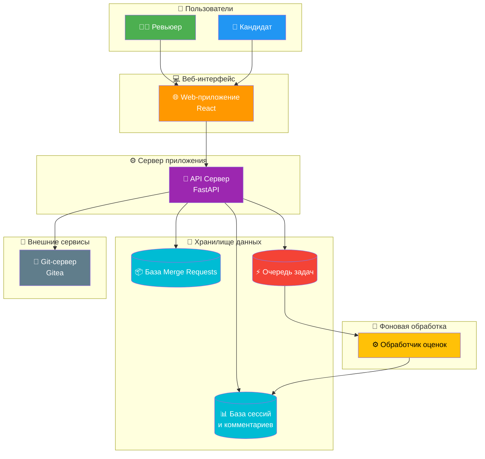
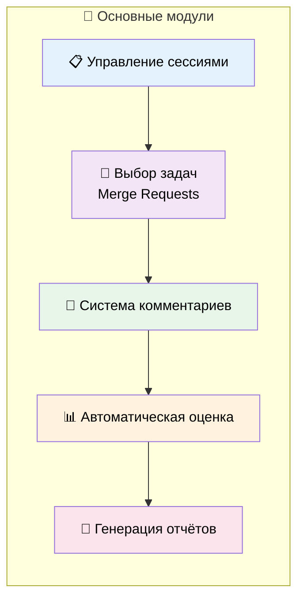
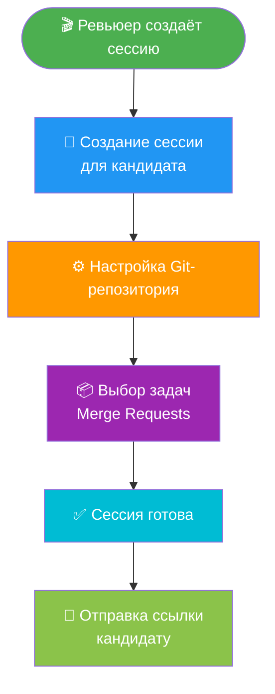
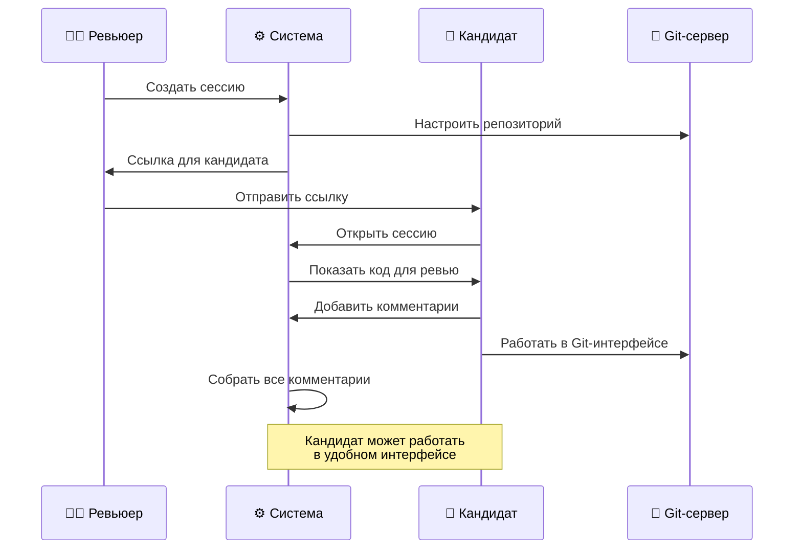
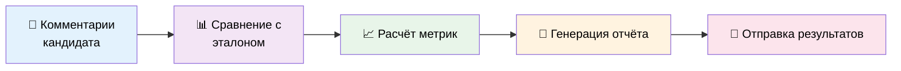
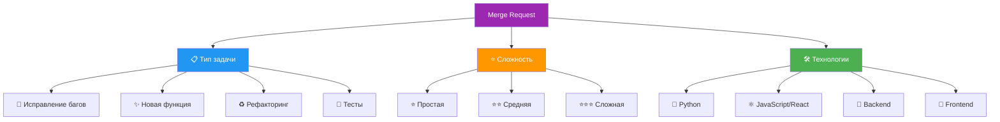
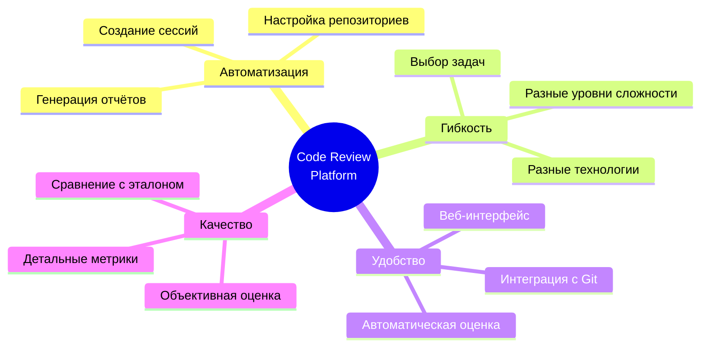
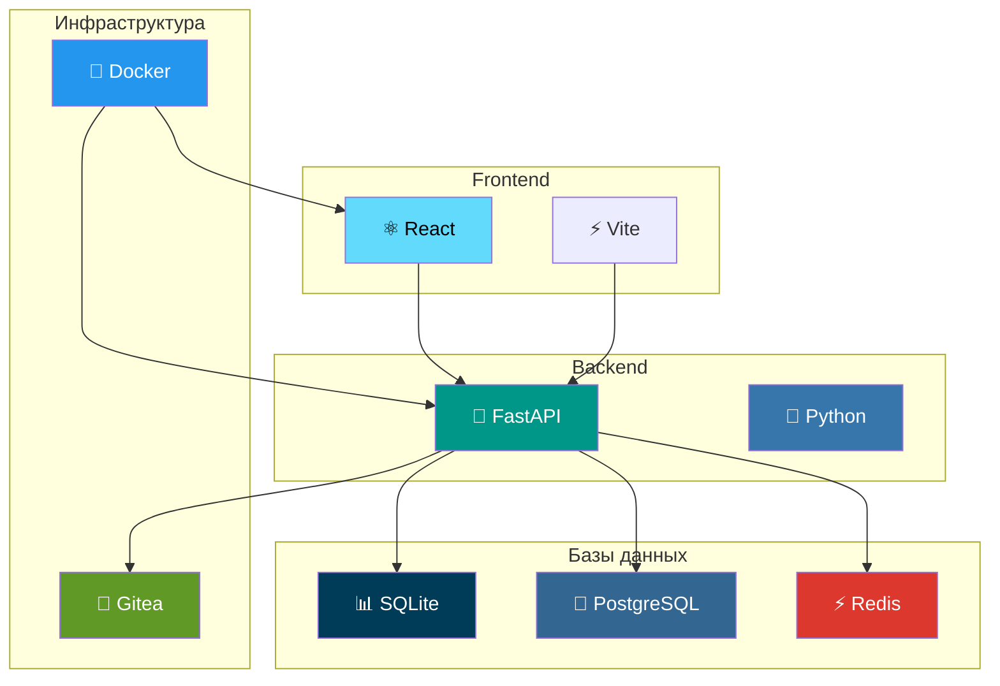
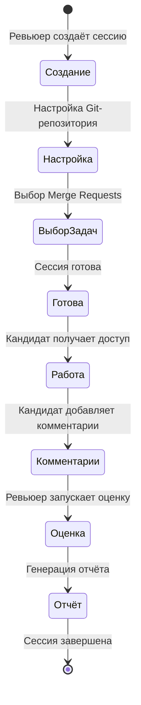
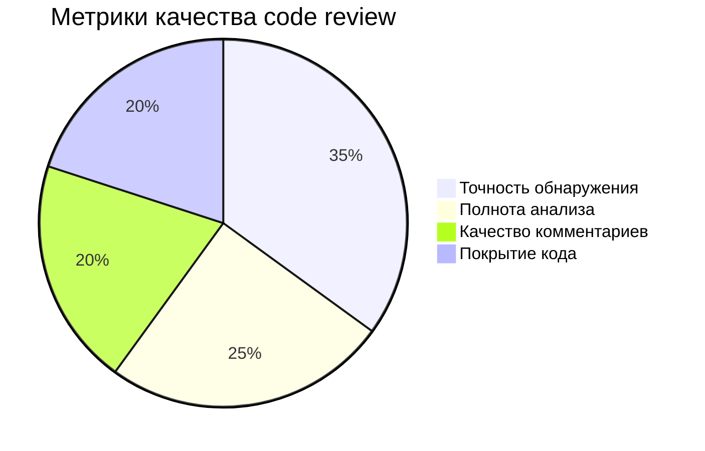

# Code Review Platform - Архитектурные диаграммы

Визуальные диаграммы архитектуры и логики работы платформы для оценки навыков code review.

## 1. Общая архитектура системы

## 2. Основные компоненты системы

## 3. Процесс создания сессии

## 4. Работа кандидата

## 5. Система оценки

## 6. Классификация задач

## 7. Преимущества системы

## 8. Технологический стек

## 9. Процесс работы системы

## 10. Метрики оценки

## Примечания

### Форматы диаграмм

Все диаграммы созданы в формате **Mermaid**, который поддерживается:
- GitHub (автоматический рендеринг в .md файлах)
- VS Code (с расширением Mermaid Preview)
- Онлайн редакторы (Notion, GitLab, и др.)
- Экспорт в PNG/SVG через Mermaid Live Editor

### Экспорт в изображения

Для экспорта диаграмм в PNG/SVG:
1. Откройте [Mermaid Live Editor](https://mermaid.live/)
2. Скопируйте код диаграммы из этого файла
3. Экспортируйте в PNG или SVG

### Использование для презентаций

Эти диаграммы оптимизированы для:
- Презентаций заказчикам
- Документации проекта
- Портфолио
- Технических обзоров
