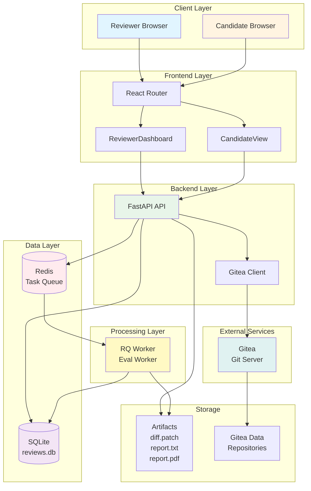
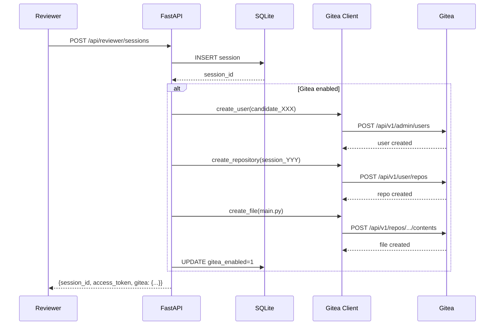
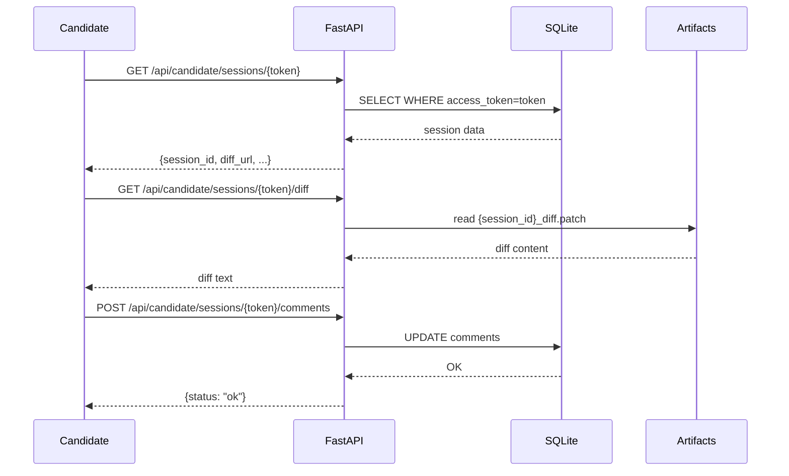
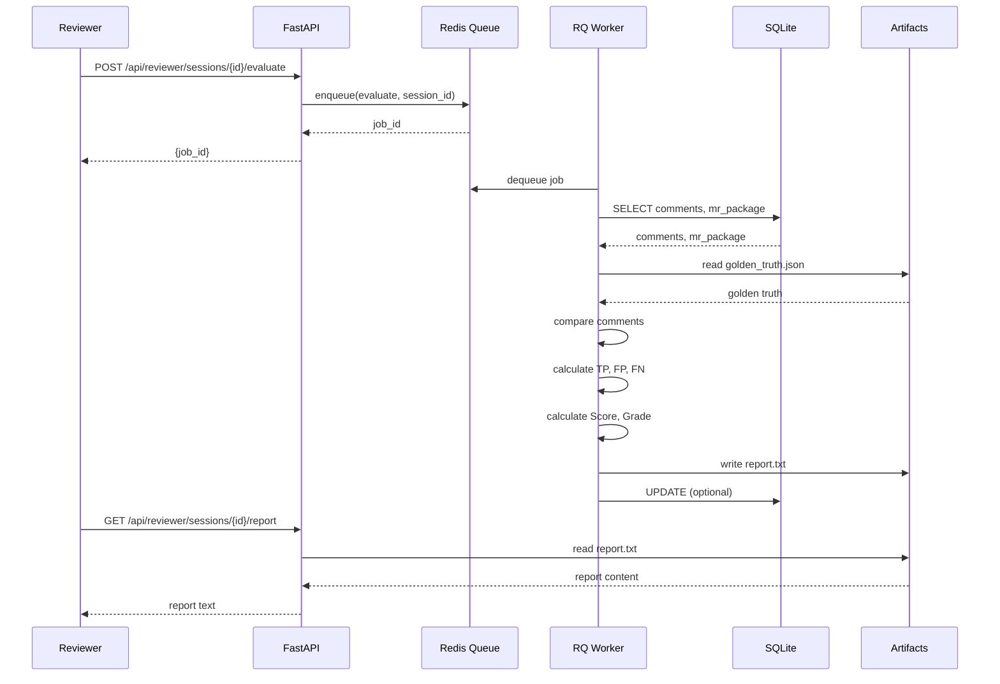
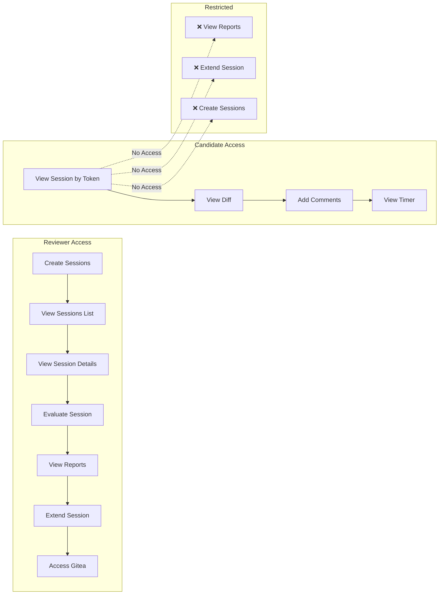
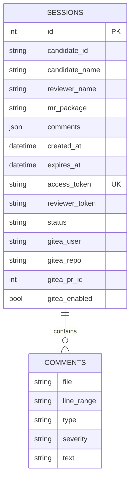
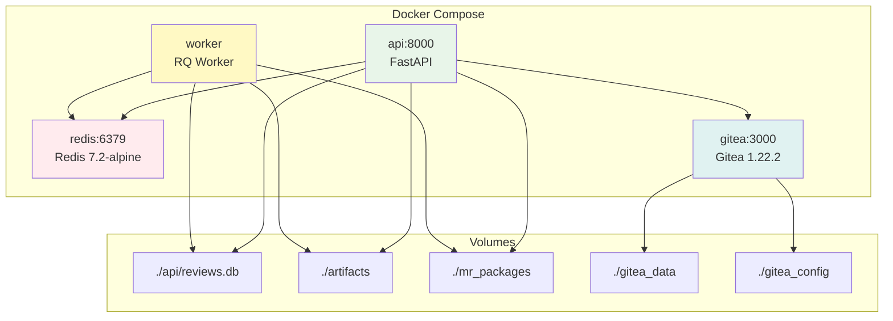
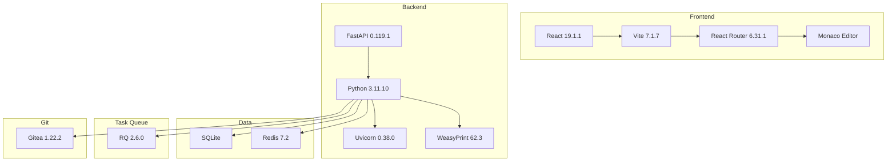

# Архитектура Code Review Platform - Визуальная диаграмма

## Общая архитектура системы

## Поток создания сессии

## Поток работы кандидата

## Поток оценки сессии

## Разделение ролей

## Структура данных

## Docker Compose Services

## Технологический стек

